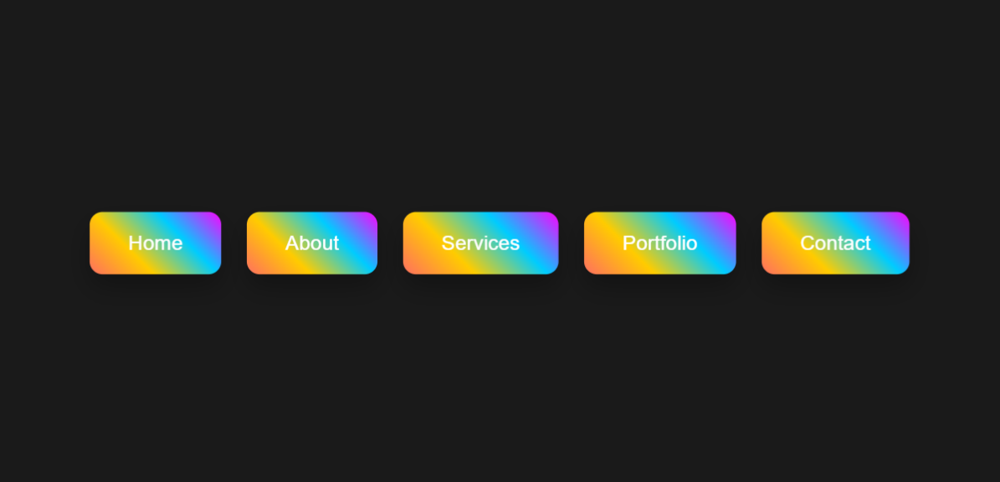

# 3D Glowing Navigation Bar 🌟

A modern, animated 3D navigation bar with glowing hover effects, dynamic color changes, and smooth scrolling. Built with HTML, CSS, and JavaScript.

  


## ✨ Features  
- 3D hover effect with perspective transforms.  
- Multi-color glow animation on hover.  
- Dynamic gradient background using CSS.  
- Smooth scroll to sections.  
- Random color generator for links.  
- Active link highlighting based on scroll position.  

## 🚀 How to Use  
1. **Clone the repository:**  
   ```bash
   git clone https://github.com/Coding-Shanks/3D-Glowing-Navbar.git
   ```
2. **Open index.html in a browser.**  

## 🛠️ Customization  
- **Change colors:** Modify the gradient in `styles.css` (look for `linear-gradient`).  
- **Adjust animations:** Tweak `transform` and `transition` values in CSS.  
- **Add/remove links:** Edit the HTML `<ul>` structure.  

## 🌐 Live Demo  
[View Live Demo](https://3-d-glowing-navbar.vercel.app/) *(Host on GitHub Pages or Netlify)*  

## 📜 License  
MIT License. See `LICENSE` for details.

## 👨💻 Author  
  Coding-Shanks
  
## 🔗 Resources Used  
- [Coolors.co](https://coolors.co/) (For gradient inspiration)  
- [Google Fonts](https://fonts.google.com/) (Arial as fallback)  

---

## 📜 MIT License (`LICENSE`)  
```text
MIT License

Copyright (c) 2023 Coding-Shanks

Permission is hereby granted, free of charge, to any person obtaining a copy
of this software and associated documentation files (the "Software"), to deal
in the Software without restriction, including without limitation the rights
to use, copy, modify, merge, publish, distribute, sublicense, and/or sell
copies of the Software, and to permit persons to whom the Software is
furnished to do so, subject to the following conditions:

The above copyright notice and this permission notice shall be included in all
copies or substantial portions of the Software.

THE SOFTWARE IS PROVIDED "AS IS", WITHOUT WARRANTY OF ANY KIND, EXPRESS OR
IMPLIED, INCLUDING BUT NOT LIMITED TO THE WARRANTIES OF MERCHANTABILITY,
FITNESS FOR A PARTICULAR PURPOSE AND NONINFRINGEMENT. IN NO EVENT SHALL THE
AUTHORS OR COPYRIGHT HOLDERS BE LIABLE FOR ANY CLAIM, DAMAGES OR OTHER
LIABILITY, WHETHER IN AN ACTION OF CONTRACT, TORT OR OTHERWISE, ARISING FROM,
OUT OF OR IN CONNECTION WITH THE SOFTWARE OR THE USE OR OTHER DEALINGS IN THE
SOFTWARE.
```

## 📤 Deploy to GitHub Pages  
1. Go to your repository **Settings > Pages**.  
2. Select the `main` branch and root folder.  
3. Save, and your project will be live at:  
   ```
   https://Coding-Shanks.github.io/3D-Glowing-Navbar
   ```


